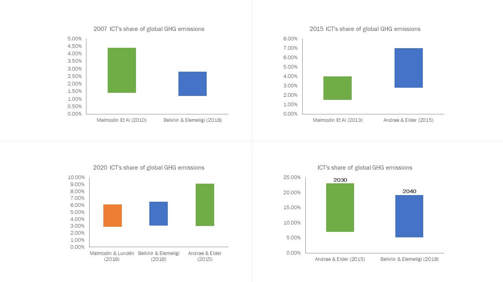

# How Software Development Impacts the Planet?

Since the Industrial Revolution, human activities have released large amounts of carbon dioxide and other greenhouse gases into the atmosphere, which has changed the earth’s climate. Nowadays, everyone feels and sees the effects of global warming, and activists in different fields try to raise awareness about what will happen if everything stays as it is now and how we can act to reduce our contribution to global warming.

You might think, _"I am a software/web developer, how does this concern me? My field has no relationship with pollution or industry... I am just writing code and designing stuff!"_ Well, I am glad you are reading this to discover that you are wrong :).

> “If the Internet were a country, it would be the 4th largest polluter.”

The ICT (Information and Communication Technology) field, in general, *contributes 1.8%–2.8% of global GHG emissions*, which is equivalent to the CO2 emissions by the aviation industry.

Figure: Global GHG Emissions in the ICT Sector

When we think about software development, we think of *_coding_*, *_databases_*, *_servers_*, and *_design_*, which are all sources of GHG emissions. 
Servers use electricity to run, so our unoptimized way of working on the server side results in more energy consumption. Furthermore, complex code that uses many loops and frequent database calls is another source of emissions. Additionally, poor design practices contribute as well, such as having a complex navigation map or using large video/image files.

That's why we are talking today about *_green software_* and how to be digitally green.

### Resources:

|          | Link     | 
| -------- | -------- |
| Res 1   | [Lean ICT](https://theshiftproject.org/en/article/lean-ict-our-new-report/)  |
| Res 2   | [EPA](https://www.epa.gov/climatechange-science/causes-climate-change)  |
| Res 3   | [Sience Direct](https://www.sciencedirect.com/science/article/pii/S2666389921001884)  |

  
⬅️ [**Introduction**](README.md)
 
➡️ [**What is Green Software?**](2_what_is_green_software.md)
