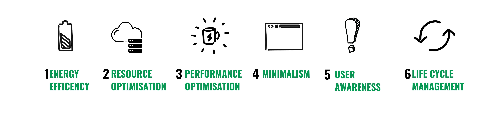
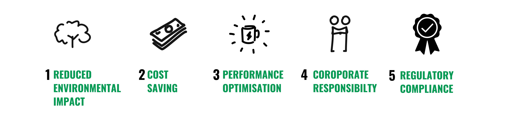

# What is Green Software?

Green software refers to the practice of designing, developing, and deploying software applications in a way that minimizes their environmental impact. This involves optimizing the software to be energy-efficient, reducing the carbon footprint of the development process, and considering sustainability throughout the software lifecycle.

#### Key Aspects of Green Software

1. *Energy Efficiency* : Techniques for reducing energy consumption during software execution. Eg. optimization of algorithms, reducing unnecessary computations, and scalable architectures and design.

2. *Resource Optimization* : Efficient use of hardware resources such as CPU, memory, and storage. Consideration of using renewable energy resources and  promoting remote work to reduce travel emissions.

3. *Performance Optimization* : Balancing performance with energy consumption.

4. *Minimalism* : Avoiding bloatware and unnecessary features that consume extra resources.

5. *User Awareness* :Educating users about the energy consumption of the software and providing them with options to use the software in more sustainable ways. This might include offering power-saving modes or advising on optimal usage times.

6. *Lifecycle Management*:  Considering the entire lifecycle of the software, from development to deployment to end-of-life. This includes planning for efficient deployment practices, monitoring the environmental impact during operation, and responsibly retiring outdated systems.

#### Benefits of Green Software

1. *Reduced Environmental Impact* :  Lower energy consumption and reduced carbon emissions contribute to a healthier planet.

2. *Cost Savings* : Energy-efficient software can lead to significant cost savings, especially in large-scale deployments and data centers.

3. *Improved Performance* : Optimizing software for energy efficiency often results in faster, more responsive applications..

4. *Corporate Responsibility* : Demonstrating a commitment to sustainability can enhance a company's reputation and align with corporate social responsibility goals.

5. *Regulatory Compliance* : As governments and regulatory bodies increasingly focus on environmental impacts, green software practices can help ensure compliance with current and future regulations.

To sum up, Green software is what you need to learn and work with as part of your role as a global citizen software developer.

  
⬅️ [**The reality: How Software Development Impacts the Planet?**](1_how_software_development_impacts_the_planet.md)
 
➡️ [**Best Practices For a Greener Software Development**](3_best_practices_for_a_green_software_dev.md)

