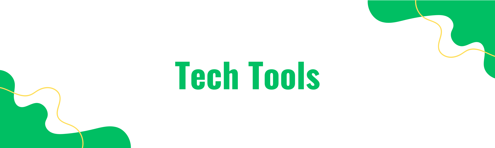

# Technologies & Tools 

There are numerous tools available that aid in the development of green software. Below, you can explore some categories of these tools:

<!DOCTYPE html>
<html lang="en">
<head>
    <meta charset="UTF-8">
    <meta name="viewport" content="width=device-width, initial-scale=1.0">
<!--     
</head>
<body>

<h2>Technologies and Tools for Sustainable Development</h2>

<table>
    <thead>
        <tr>
            <th>Category</th>
            <th>Tool/Technology</th>
            <th>Description</th>
        </tr>
    </thead>
    <tbody>
        <tr>
        <td rowspan="3"><strong>Green Hosting Providers</strong></td>
            <td>GreenGeeks</td>
            <td>Eco-friendly web hosting that matches 3 times the energy they consume in the form of renewable energy credits.</td>
        </tr>
        <tr>
            <td>A2 Hosting</td>
            <td>Committed to offsetting their servers' carbon footprint by supporting reforestation and other green projects.</td>
        </tr>
        <tr>
            <td>DreamHost</td>
            <td>Uses renewable energy and has a partnership with clean energy providers.</td>
        </tr>
        <tr>
            <td rowspan="2"><strong>Green Search Engines</strong></td>
            <td>GOOD</td>
            <td>When you search with GOOD, you support innovative projects that contribute to the UN’s 17 Sustainable Development Goals (SDGs), with a new project supported each month.</td>
        </tr>
        <tr>
            <td>Ecosia</td>
            <td>They dedicate 100% of our profits to the planet. That means you can plant trees, protect endangered animals, and uplift communities around the world simply by browsing.</td>
        </tr>
        <tr>
            <td rowspan="3"><strong>Data and Database Optimization</strong></td>
            <td>Redis</td>
            <td>An in-memory data structure store used as a database, cache, and message broker to reduce load on primary databases.</td>
        </tr>
        <tr>
            <td>Elasticsearch</td>
            <td>A search engine that enables quick search capabilities while offloading the primary database.</td>
        </tr>
        <tr>
            <td>Query Monitor</td>
            <td>A debugging plugin for WordPress that shows detailed information about database queries to optimize them.</td>
        </tr>
        <tr>
            <td rowspan="2"><strong>Sustainable Design Practices</strong></td>
            <td>Tinify</td>
            <td>Smart WebP, PNG and JPEG Compression for Faster Websites.</td>
        </tr>
        <tr>
            <td>Sketch</td>
            <td>Enables efficient vector graphics editing and prototyping with a focus on minimalism and performance.</td>
        </tr>
        <tr>
            <td rowspan="2"><strong>Code Efficiency and Optimization Tools</strong></td>
            <td>Blackfire.io</td>
            <td>A performance management solution for PHP that helps identify and fix performance bottlenecks.</td>
        </tr>
        <tr>
            <td>PHPBench</td>
            <td>A benchmarking tool for PHP to help measure the performance of your code.</td>
        </tr>
        <tr>
            <td rowspan="2"><strong>Monitoring and Analysis Tools</strong></td>
            <td>New Relic</td>
            <td>Provides real-time insights into application performance and helps identify inefficient code paths.</td>
        </tr>
        <tr>
            <td>Datadog</td>
            <td>Offers monitoring and analytics to help optimize resource usage and improve application efficiency.</td>
        </tr>
        <tr>
            <td rowspan="2"><strong>Measuring Digital Carbon Footprint</strong></td>
            <td>Ecograder </td>
            <td>It utilizes CO2.js from The Green Web Foundation, as well as Google Lighthouse's open source page metrics, to identify tasks that will improve a website.</td>
        </tr>
        <tr>
            <td>Website Carbon Calculator</td>
            <td>Helps estimating the carbon emissions attributed to a website.</td>
        </tr>
    </tbody>
</table>

These are some of the tools that can help kick-start your journey with green software development ☘️.
</body>
</html>

  
⬅️ [**Examples of Codes**](4_examples_of_codes.md)
 
➡️ [**Dig Deeper into Green Software**](6_dig_deeper_into_it.md)
