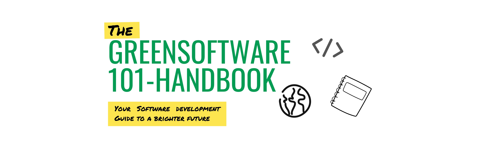
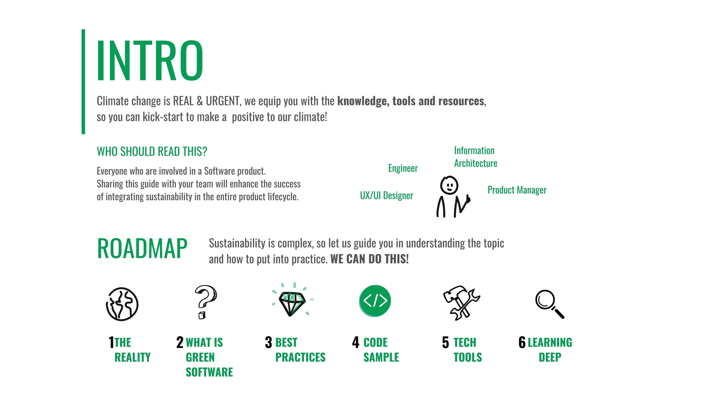

# GreenSoftware101HandBook 

A “Getting Started” guide to help onboard new developers to green software development practices to apply to their open source projects.

<!-- As we all know: -->

<!--  -->

<!--  

In order to help you with that, the **GreenSoftware101HandBook** follows these steps to make you understand the whole context and move to action:

  -->

Each part of the guide plays a very important role in building your basic understanding of green software.

### ROADMAP:

  <!-- - [Introduction](README.md) -->
1. [**The reality: How Software Development Impacts the Planet?**](1_how_software_development_impacts_the_planet.md)
2. [**What is Green Software?**](2_what_is_green_software.md)
3. [**Best Practices For a Greener Software Development**](3_best_practices_for_a_green_software_dev.md)
4. [**Examples of Codes**](4_examples_of_codes.md)
5. [**Technologies & Tools**](5_technologies_&_tools.md)
6. [**Dig Deeper into Green Software**](6_dig_deeper_into_it.md)

## CONTEXT:

The **GreenSoftware101HandBook** is created in the context of [HACK FOR THE PLANET](https://www.hackfortheplanet.org/) a three days online climate hackathon. And it responds specifically to the challenge sponsored by GitHub [Getting Started Guide for Green Software](https://docs.google.com/document/d/1nb__OP2lStQe7D3KoXWIS5TJYC5OpPLoOFQlrDj5LKM/edit#heading=h.9jcaj7unh4mu).

## TEAM:

- **Hajar Aafane** - Full-Stack Web Developer -  
  - Hajar is a proficient and result-driven Full Stack Web Developer with expertise in PHP, HTML, CSS, MySQL, and Symfony. She is deeply passionate about utilizing technology to create a positive impact on the environment and actively seeking opportunities to contribute in this space.

- **Winifred Ting** - UX Designer -  
  - "Let's collaborate to promote sustainability practices for impactful product development...and also, if you like rock climbing".
